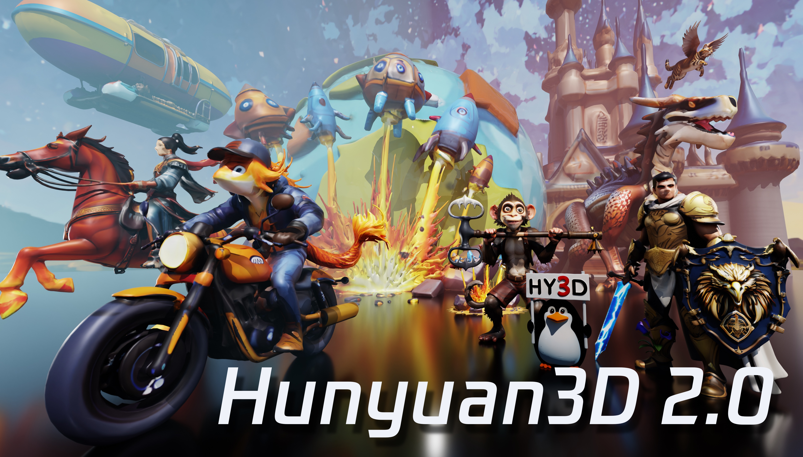
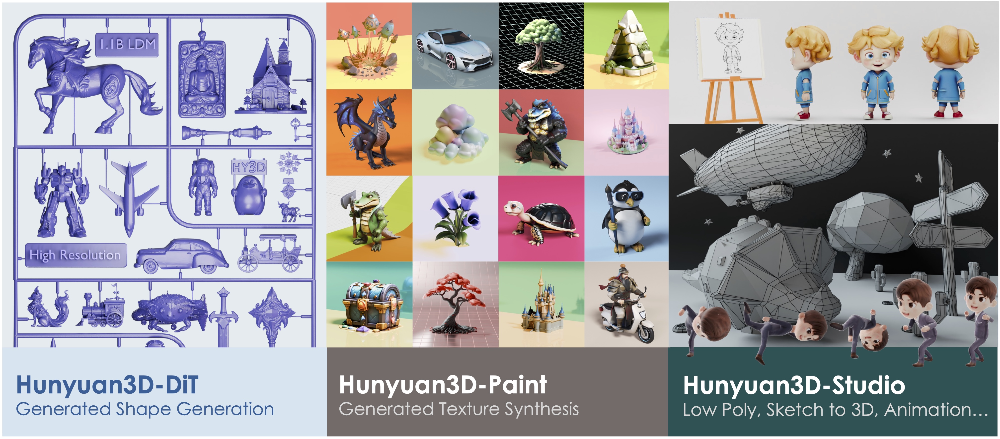
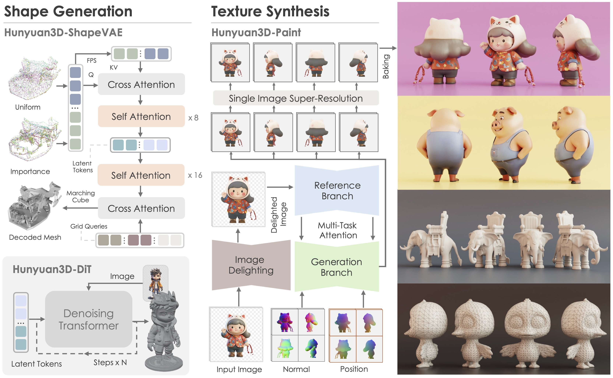

[Read in English](README.md)
[中文阅读](README_zh_cn.md)

<p align="center"> 
  


</p>

<div align="center">
  <a href=https://3d.hunyuan.tencent.com target="_blank"></a>
  <a href=https://huggingface.co/spaces/tencent/Hunyuan3D-2  target="_blank"></a>
  <a href=https://huggingface.co/tencent/Hunyuan3D-2 target="_blank"></a>
  <a href=https://3d-models.hunyuan.tencent.com/ target="_blank"></a>
  <a href=https://discord.gg/dNBrdrGGMa target="_blank"></a>
  <a href=https://github.com/Tencent/Hunyuan3D-2/blob/main/assets/report/Tencent_Hunyuan3D_2_0.pdf target="_blank"></a>
</div>


[//]: # (  <a href=# target="_blank"></a>)

[//]: # (  <a href=# target="_blank"></a>)

[//]: # (  <a href="#"></a>)

<br>
<p align="center">
“ 3Dアセットの作成と操作において、すべての人の想像力を実現します。”
</p>

## 🔥 ニュース

- 2025年2月14日: 🛠️ テクスチャ強化モジュールをリリースしました。HD テクスチャ生成を [体験](minimal_demo.py) してください。
- 2025年1月21日: 💬 私たちのウェブサイト [Hunyuan3D Studio](https://3d.hunyuan.tencent.com) でエキサイティングな3D生成を楽しんでください！
- 2025年1月21日: 💬 [Hunyuan3D 2.0](https://huggingface.co/tencent/Hunyuan3D-2) の推論コードと事前学習モデルをリリースしました。
- 2025年1月21日: 💬 Hunyuan3D 2.0をリリースしました。 [huggingface space](https://huggingface.co/spaces/tencent/Hunyuan3D-2) や [公式サイト](https://3d.hunyuan.tencent.com) でお試しください！

## **概要**

Hunyuan3D 2.0は、高解像度のテクスチャ付き3Dアセットを生成するための高度な大規模3D合成システムです。
このシステムには、2つの基盤コンポーネントが含まれています：大規模形状生成モデル - Hunyuan3D-DiT、および大規模
テクスチャ合成モデル - Hunyuan3D-Paint。
形状生成モデルは、スケーラブルなフローに基づく拡散トランスフォーマーに基づいて構築されており、与えられた条件画像に適切に
一致するジオメトリを作成することを目的としており、下流のアプリケーションのための堅固な基盤を提供します。
テクスチャ合成モデルは、強力なジオメトリおよび拡散の事前知識を活用して、生成されたまたは手作りのメッシュのために高解像度で鮮やかな
テクスチャマップを生成します。
さらに、Hunyuan3D-Studioを構築しました。これは、3Dアセットの再作成プロセスを簡素化する多用途で使いやすい制作プラットフォームです。
プロフェッショナルおよびアマチュアユー���ーの両方がメッシュを効率的に操作したり、アニメーション化したりすることができます。
私たちはモデルを体系的に評価し、Hunyuan3D 2.0が以前の最先端モデルを上回ることを示しました。
オープンソースモデルとクローズドソースモデルの両方で、ジオメトリの詳細、条件の整合性、テクスチャの品質などの点で優れています。


<p align="center">
  
</p>

## ☯️ **Hunyuan3D 2.0**

### アーキテクチャ

Hunyuan3D 2.0は、ベアメッシュの作成から始まり、そのメッシュのテクスチャマップの合成に至る2段階の生成パイプライン���特徴としています。
この戦略は、形状とテクスチャの生成の難しさを分離するのに効果的であり、生成されたメッシュまたは手作りのメッシュのテクスチャリングに柔軟性を提供します。

<p align="left">
  
</p>

### パフォーマンス

Hunyuan3D 2.0を他のオープンソースおよびクローズドソースの3D生成方法と比較して評価しました。
数値結果は、Hunyuan3D 2.0が生成されたテクスチャ付き3Dアセットの品質と条件の遵守能力においてすべてのベースラインを上回っていることを示しています。

| モデル                   | CMMD(⬇)   | FID_CLIP(⬇) | FID(⬇)      | CLIP-score(⬆) |
|-------------------------|-----------|-------------|-------------|---------------|
| トップオープンソースモデル1  | 3.591     | 54.639      | 289.287     | 0.787         |
| トップクローズドソースモデル1 | 3.600     | 55.866      | 305.922     | 0.779         |
| トップクローズドソースモデル2 | 3.368     | 49.744      | 294.628     | 0.806         |
| トップクローズドソースモデル3 | 3.218     | 51.574      | 295.691     | 0.799         |
| Hunyuan3D 2.0           | **3.193** | **49.165**  | **282.429** | **0.809**     |

Hunyuan3D 2.0の生成結果：
<p align="left">
  
  
</p>

### 事前学習モデル

| モデル                | 日付       | Huggingface                                            |
|----------------------|------------|--------------------------------------------------------| 
| Hunyuan3D-DiT-v2-0   | 2025-01-21 | [ダウンロード](https://huggingface.co/tencent/Hunyuan3D-2) |
| Hunyuan3D-Paint-v2-0 | 2025-01-21 | [ダウンロード](https://huggingface.co/tencent/Hunyuan3D-2) |

## 🤗 Hunyuan3D 2.0の使い方

次の手順に従って、コードまたはGradioアプリを使用してHunyuan3D 2.0を使用できます。

### 必要なものをインストール

公式サイトからPytorchをインストールしてください。次に、他の必要なものを以下の方法でインストールします。

```bash
pip install -r requirements.txt
# for texture
cd hy3dgen/texgen/custom_rasterizer
python3 setup.py install
cd hy3dgen/texgen/differentiable_renderer
python3 setup.py install
```

### APIの使い方

形状生成モデル - Hunyuan3D-DiTおよびテクスチャ合成モデル - Hunyuan3D-Paintを使用するためのdiffusersのようなAPIを設計しました。

**Hunyuan3D-DiT**にアクセスするには、次のようにします：

```python
from hy3dgen.shapegen import Hunyuan3DDiTFlowMatchingPipeline

pipeline = Hunyuan3DDiTFlowMatchingPipeline.from_pretrained('tencent/Hunyuan3D-2')
mesh = pipeline(image='assets/demo.png')[0]
```

出力メッシュは[trimeshオブジェクト](https://trimesh.org/trimesh.html)であり、glb/obj（または他の形式）ファイルに保存できます。

**Hunyuan3D-Paint**の場合は、次のようにします：

```python
from hy3dgen.texgen import Hunyuan3DPaintPipeline
from hy3dgen.shapegen import Hunyuan3DDiTFlowMatchingPipeline

# まずメッシュを生成しましょう
pipeline = Hunyuan3DDiTFlowMatchingPipeline.from_pretrained('tencent/Hunyuan3D-2')
mesh = pipeline(image='assets/demo.png')[0]

pipeline = Hunyuan3DPaintPipeline.from_pretrained('tencent/Hunyuan3D-2')
mesh = pipeline(mesh, image='assets/demo.png')
```

より高度な使用法については、[minimal_demo.py](minimal_demo.py)を参照してください。例えば、**テキストから3D**や**手作りメッシュのテクスチャ生成**などです。

### Gradioアプリ

次の方法で自分のコンピュータで[Gradio](https://www.gradio.app/)アプリをホストすることもできます：

```bash
python3 gradio_app.py
```

自分でホストしたくない場合は、[Hunyuan3D](https://3d.hunyuan.tencent.com)を訪れてすぐに使用してください。

## 📑 オープンソース計画

- [x] 推論コード
- [x] モデルチェックポイント
- [x] 技術報告書
- [ ] ComfyUI
- [ ] TensorRTバージョン

## 🔗 BibTeX

このリポジトリが役に立った場合は、以下の方法で報告書を引用してください：

```bibtex
@misc{hunyuan3d22025tencent,
    title={Hunyuan3D 2.0: Scaling Diffusion Models for High Resolution Textured 3D Assets Generation},
    author={Tencent Hunyuan3D Team},
    year={2025},
    eprint={2501.12202},
    archivePrefix={arXiv},
    primaryClass={cs.CV}
}

@misc{yang2024hunyuan3d,
    title={Hunyuan3D 1.0: A Unified Framework for Text-to-3D and Image-to-3D Generation},
    author={Tencent Hunyuan3D Team},
    year={2024},
    eprint={2411.02293},
    archivePrefix={arXiv},
    primaryClass={cs.CV}
}
```

## 謝辞

[DINOv2](https://github.com/facebookresearch/dinov2), [Stable Diffusion](https://github.com/Stability-AI/stablediffusion), [FLUX](https://github.com/black-forest-labs/flux), [diffusers](https://github.com/huggingface/diffusers), [HuggingFace](https://huggingface.co), [CraftsMan3D](https://github.com/wyysf-98/CraftsMan3D), and [Michelangelo](https://github.com/NeuralCarver/Michelangelo/tree/main) リポジトリの貢献者に感謝します。

## スター履歴

<a href="https://star-history.com/#Tencent/Hunyuan3D-2&Date">
 <picture>
   <source media="(prefers-color-scheme: dark)" srcset="https://api.star-history.com/svg?repos=Tencent/Hunyuan3D-2&type=Date&theme=dark" />
   <source media="(prefers-color-scheme: light)" srcset="https://api.star-history.com/svg?repos=Tencent/Hunyuan3D-2&type=Date" />
   
 </picture>
</a>
